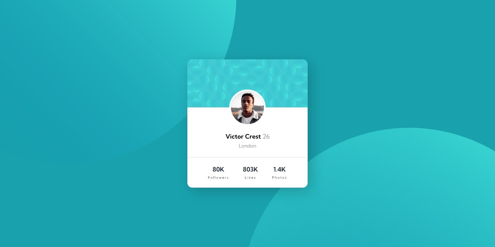
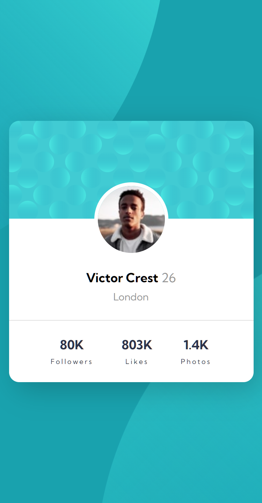

# Frontend Mentor - Profile card component solution

This is a solution to the [Profile card component challenge on Frontend Mentor](https://www.frontendmentor.io/challenges/profile-card-component-cfArpWshJ). Frontend Mentor challenges help you improve your coding skills by building realistic projects.  

## Table of contents

- [Frontend Mentor - Profile card component solution](#frontend-mentor---profile-card-component-solution)
  - [Table of contents](#table-of-contents)
  - [Overview](#overview)
    - [The challenge](#the-challenge)
    - [Screenshot](#screenshot)
    - [Links](#links)
  - [My process](#my-process)
    - [Built with](#built-with)
    - [What I learned](#what-i-learned)
    - [Continued development](#continued-development)
  - [Author](#author)

## Overview

### The challenge

- Build out the project to the designs provided

### Screenshot

web  

mobile  
<center>
  
</center>

### Links

- Solution URL: [GitHub](https://github.com/mstytn/front-end-mentor-profile-card)
- Live Site URL: [GitHub Live](https://mstytn.github.io/front-end-mentor-profile-card)

## My process

### Built with

- Semantic HTML5 markup / Not semantic only the all page wrapped in ```main``` tag
- CSS custom properties
- Flexbox

### What I learned

Make border thinner with opacity. Border doesn't get smaller than 1px  

To see how you can add code snippets, see below:

```css
  border-top: 0.1px solid hsla(0, 0%, 59%, .3);
```

### Continued development

Placing background images (the circle one) was a bit challenging. I'm not happy with the result when resizing window. Circles acts weird. My be fixed with js.

## Author

- Website - [Mustafa Yatagan](https://github.com/mstytn)
- Frontend Mentor - [@mstytn](https://www.frontendmentor.io/profile/mstytn)
